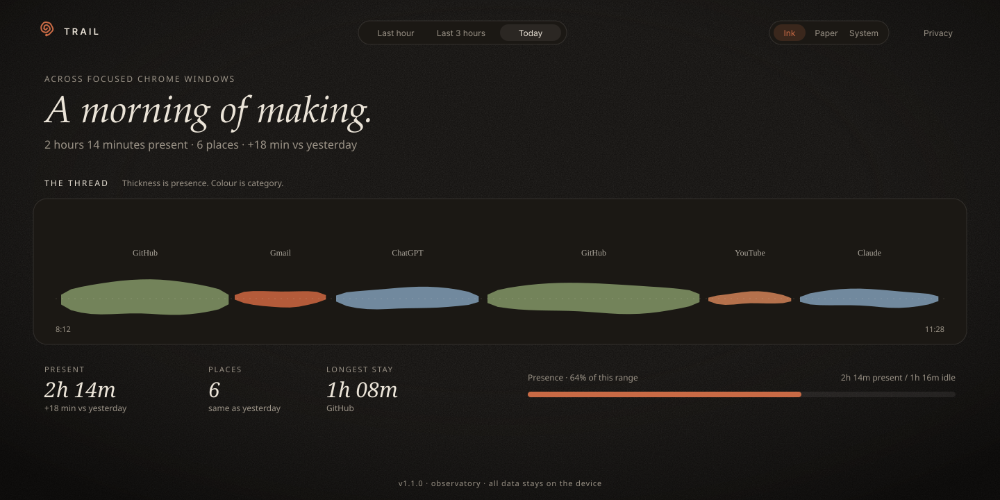

# Trail

[](https://github.com/gundaIf/trail-extension/releases/latest)
[](LICENSE)
[](manifest.json)
[](#privacy)

A privacy-first Chrome extension that tracks **active-tab time** across focused
Chrome windows, then shows the trail it left.

No accounts. No servers. Nothing leaves the device.

<p align="center">
  
</p>

## Install

### From the [v1.1.0 release](https://github.com/gundaIf/trail-extension/releases/tag/v1.1.0)

1. Download **[`trail-extension-v1.1.0.zip`](https://github.com/gundaIf/trail-extension/releases/latest/download/trail-extension-v1.1.0.zip)** and unzip it.
2. Open `chrome://extensions` and turn on **Developer mode** (top-right).
3. Click **Load unpacked** and select the unzipped **`trail-extension`** folder.
4. Pin the Trail icon, browse normally for a bit, then click it → **Open the observatory**.

Works in Chrome, Brave, Edge, Arc, and other Chromium browsers.

Already have Trail loaded? Click **Reload** on the extension card after dropping in this version.

### From source

```bash
git clone https://github.com/gundaIf/trail-extension.git
```

Load that folder unpacked, as above. There is **no build step**: vanilla HTML, CSS, and JS.

> Open `dashboard.html` directly to preview the observatory with a sample morning, without installing.

## What’s new in 1.1: Observatory

The dashboard is no longer a card layout. It is an instrument of attention.

| 1.0 | 1.1 |
| --- | --- |
| KPI cards, line chart, donut | A presence **thread**, minute **lattice**, visit **journal** |
| Dark / Default / System | **Ink**, **Paper**, **System**: grain, letter seals, serif narrative |
| “0 min observed” for a 15-second visit | Seconds are seconds. Never rounded to zero. |

### Surfaces

| Surface | What it shows |
| --- | --- |
| **The thread** | Presence over time. Thickness = seconds in that minute. Colour = category. Hover a minute; click a place to isolate it. |
| **Present / idle** | Clock time vs observed active-tab time, vs the previous range. |
| **Places** | Ranked hosts with ink bars and letter seals. Click to isolate on the thread. |
| **Minute lattice** | One cell per minute, from first presence. |
| **Pigment** | Category share as a stacked ribbon, not a donut. |
| **Journal** | Visits in chronological order, newest first. Nearby stays on the same host merge (8-minute gap). |

Ranges: last hour · last 3 hours · today.

## How tracking works

Unchanged from 1.0. The observatory is a new lens on the same on-device log.

- Counts time only for the **active tab in the focused window**.
- Pauses when you’re **idle** (60s), the window loses focus, the screen locks, or you’re on a `chrome://` / non-web page.
- Time is stored in **per-minute buckets** per site, kept for ~3 days.
- A 1-minute alarm + a 5-minute per-flush cap keep long sessions accurate and guard against overcounting after sleep.

## Privacy

Trail has no backend. Tracking never phones home.

| | |
| --- | --- |
| Stored | `chrome.storage.local` on this device |
| Sent | nothing |
| Accounts | none |
| Network | none, for tracking. The observatory loads [Instrument](https://fonts.google.com/specimen/Instrument+Sans) from Google Fonts when you’re online; the log itself does not need the network. |

The **Privacy** button in the observatory says the same thing in the product.

## Customize

- **Categories**: the `RULES` array in [`trail-lib.js`](trail-lib.js)
- **History length / idle threshold**: constants at the top of [`background.js`](background.js)
- **Colors / themes**: the `:root` token blocks in [`dashboard.css`](dashboard.css)

Theme is remembered in `localStorage['trail-theme']` (`ink` / `paper` / `system`). Older `dark` / `default` values migrate automatically.

## Files

| File | Role |
| --- | --- |
| `manifest.json` | MV3 config, permissions (`tabs`, `storage`, `idle`, `alarms`) |
| `background.js` | Service worker: the tracking engine |
| `dashboard.html/css/js` | Observatory UI (SVG thread, no libraries) |
| `trail-lib.js` | Categories, aggregation, demo data, formatting |
| `popup.html/css/js` | Toolbar popup: last-hour summary |
| `generate-icons.js` | Regenerates the hand-drawn spiral logo (`node generate-icons.js`) |

## Changelog

See [CHANGELOG.md](CHANGELOG.md) and the [releases](https://github.com/gundaIf/trail-extension/releases).

## License

[MIT](LICENSE) © 2026 Deen David
